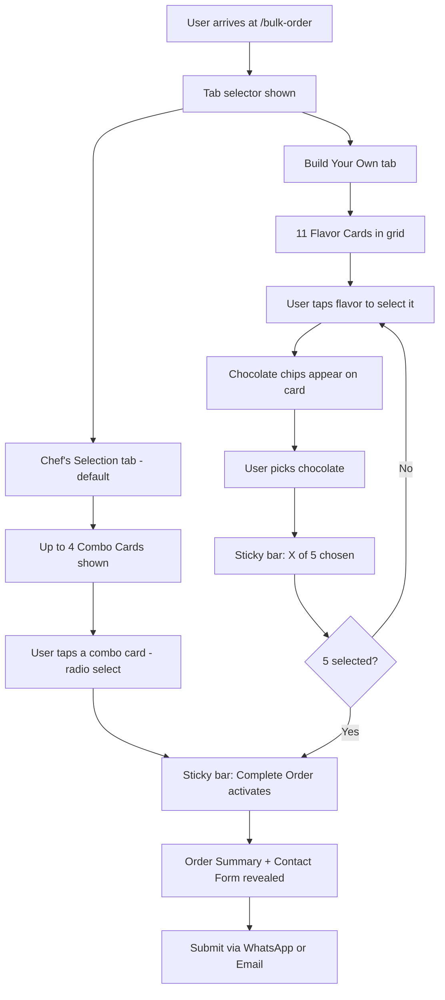

# 🍫 Bulk Praline Order — "Pick Your 5" UX Design

## 0. Configuration via Feature Flags

All thresholds are controlled via environment variables in [`src/config/featureFlags.js`](src/config/featureFlags.js) — **no code changes needed** to adjust limits.

```js
// src/config/featureFlags.js additions
bulkOrder: {
  enabled:         import.meta.env.VITE_BULK_ORDER_ENABLED          !== 'false',
  qtyPerFlavor:    Number(import.meta.env.VITE_BULK_ORDER_QTY_PER_FLAVOR)  || 20,
  maxFlavors:      Number(import.meta.env.VITE_BULK_ORDER_MAX_FLAVORS)     || 5,
}
```

### Environment Variables

| Variable | Default | Purpose |
|---|---|---|
| `VITE_BULK_ORDER_ENABLED` | `true` | Show/hide the bulk order page and nav link |
| `VITE_BULK_ORDER_QTY_PER_FLAVOR` | `20` | Fixed quantity per selected flavor |
| `VITE_BULK_ORDER_MAX_FLAVORS` | `5` | Maximum number of flavors a customer can select |

> **Total pralines = `qtyPerFlavor × maxFlavors` = 20 × 5 = 100** (controlled entirely by env vars)

---

## 1. Problem Statement

The existing **"Build Your Box"** feature ([`src/pages/PralineBuilder.jsx`](src/pages/PralineBuilder.jsx)) requires the user to configure each praline slot individually. For a **minimum order of 100 pralines** this is completely unusable.

**Goal:** A bulk order UI where configuring 100 pralines takes **2–10 taps** depending on the path chosen.

---

## 2. Data

### Chocolate Bases — 4 types ([`src/data/pralines.js`](src/data/pralines.js))

| ID | Label | Color |
|----|-------|-------|
| `dark_70` | Dark 70% | `#3B1F0E` |
| `dark_50` | Dark 50% | `#5C3317` |
| `milk` | Milk | `#C68642` |
| `white` | White | `#FFF5DC` |

### Fillings — 16 flavors (full list, all 3 languages)

> **Note:** All flavors below replace the old list in [`src/data/pralines.js`](src/data/pralines.js). Several are new and must be added.

| ID | English | Hebrew | Portuguese | Emoji |
|----|---------|--------|------------|-------|
| `strawberry` | Strawberry | תות | Morango | 🍓 |
| `mango` | Mango | מנגו | Manga | 🥭 |
| `cherry` | Cherry | דובדבן | Cereja | 🍒 |
| `lotus` | Lotus | לוטוס | Lotus | ✨ |
| `nutella` | Nutella | נוטלה | Nutella | 🍫 |
| `caramel` | Caramel | קרמל | Caramelo | 🍮 |
| `vanilla` | Vanilla | וניל | Vanila | 🌼 |
| `pistachio` | Pistachio | פיסטוק | Pistachio | 💚 |
| `coconut` | Coconut | קוקוס | Kokos | 🥥 |
| `nuts` | Nuts | אגוזים | Nozes | 🌰 |
| `halva` | Halva | חלבה | Chalva | ✨ |
| `cafe` | Café | קפה | Café | ☕ |
| `caipirinha` | Caipirinha | קאיפיריניה | Caipirinha | 🍋 |
| `wine_cinnamon` | Wine & Cinnamon | יין וקינמון | Vinho com canela | 🍷 |
| `mascarpone` | Mascarpone | מסקרפונה | Mascarpone | 🤍 |
| `lemon_sicilian` | Sicilian Lemon | לימון סיציליאני | Limão siciliano | 🍋 |

---

## 3. UX Concept: Two Paths to 100 Pralines

The page offers **two modes** — the customer picks one via a tab at the top:

### Path A — "Chef's Selection" (Predefined Combinations)
Talya curates up to 4 named combinations. Each is a complete, fixed set of 5 flavors × 20 pralines with chocolates pre-assigned. The customer picks one combination and submits — **2 taps total**.

### Path B — "Build Your Own" (Custom Mix)
The customer picks any 5 flavors from 11 cards and assigns a chocolate to each. **10 taps maximum.**

Both paths produce the same output: 100 pralines with a full flavor + chocolate breakdown sent to Talya.

---

## 3a. Predefined Combinations Data Model

Combinations live in [`src/data/pralines.js`](src/data/pralines.js) as a plain exported array — **no component changes needed** to add or edit them:

```js
export const predefinedCombinations = [
  {
    id: 'classic',
    nameKey: 'bulk_order.combos.classic.name',
    descKey:  'bulk_order.combos.classic.desc',
    emoji: '🎩',
    selections: [
      { filling: 'pistachio', base: 'dark_70' },
      { filling: 'caramel',   base: 'milk'    },
      { filling: 'vanilla',   base: 'white'   },
      { filling: 'cherry',    base: 'dark_50' },
      { filling: 'halva',     base: 'dark_70' },
    ],
  },
  // ... up to 4 combinations total
]
```

**Auto-hide rule:** If `predefinedCombinations` is an empty array, the "Chef's Selection" tab is hidden automatically and the page goes straight to "Build Your Own".

---

## 3b. Page Mode Switcher

At the top of the page, a tab toggle lets the user switch between the two paths:

```
[ 🎩 Chef's Selection ]  [ 🎨 Build Your Own ]
```

- **Default tab:** Chef's Selection (shown first — lowest friction)
- If no predefined combinations exist, skip the tab and show Build Your Own directly

---

## 4. User Flow



---

## 5. Page Layout & Components

### 5.1 Page: `/bulk-order` — `BulkPralineOrder.jsx`

```
┌─────────────────────────────────────────────────────────┐
│  HEADER                                                 │
│  "Order Pralines in Bulk"                               │
│  "Choose 5 flavors · 20 of each · 100 pralines total"  │
├─────────────────────────────────────────────────────────┤
│  TAB SWITCHER                                           │
│  [ 🎩 Chef's Selection ]  [ 🎨 Build Your Own ]         │
├─────────────────────────────────────────────────────────┤
│  TAB A: CHEF'S SELECTION                                │
│  ┌────────────────────────────────────────────────┐    │
│  │ 🎩 The Classic                                 │    │
│  │ "Our most beloved combination"                 │    │
│  │ 🌿 Pistachio · Dark 70%                       │    │
│  │ 🍯 Caramel · Milk                             │    │
│  │ 🌼 Vanilla · White                            │    │
│  │ 🍒 Cherry · Dark 50%                          │    │
│  │ 🌾 Halva · Dark 70%                           │    │
│  │ 100 pralines · Est. ₪980   [Select This Box]  │    │
│  └────────────────────────────────────────────────┘    │
│  (up to 4 combo cards)                                  │
├─────────────────────────────────────────────────────────┤
│  TAB B: BUILD YOUR OWN                                  │
│  ┌──────────┐ ┌──────────┐ ┌──────────┐ ┌──────────┐  │
│  │ 🌿  ✓   │ │ 🍯       │ │ 🌼       │ │ 🍒       │  │
│  │Pistachio │ │ Caramel  │ │ Vanilla  │ │ Cherry   │  │
│  │ ● ○ ○ ○  │ │  [+Add]  │ │  [+Add]  │ │  [+Add]  │  │
│  │ Dark 70% │ │          │ │          │ │          │  │
│  └──────────┘ └──────────┘ └──────────┘ └──────────┘  │
│  (11 flavor cards total)                                │
├─────────────────────────────────────────────────────────┤
│  STICKY BOTTOM BAR                                      │
│  ● ● ● ○ ○   3 of 5 flavors chosen                     │
│  Est. ₪600              [Complete Order →] (disabled)   │
└─────────────────────────────────────────────────────────┘
```

### 5.2 Combo Card — `ComboCard.jsx`

Each predefined combination card shows:
- Name + emoji + short description
- A mini flavor list: "🌿 Pistachio · Dark 70% · 🍯 Caramel · Milk · ..."
- Estimated price (calculated from the selections array)
- "Select This Box" button

**States:**
- `unselected` — normal card
- `selected` — colored border + checkmark, "Selected ✓" label
- Only one combo can be selected at a time (radio-style)

### 5.3 Flavor Card — `FlavorCard.jsx`

Each card has three visual states:

**Unselected:**
```
┌──────────────────┐
│  🌿              │
│  Pistachio       │
│  ₪10 per praline │
│  [+ Select]      │
└──────────────────┘
```

**Selected** (colored left border):
```
┌──────────────────┐
│  🌿  ✓  20 pcs  │
│  Pistachio       │
│  ● ○ ○ ○         │
│  Dark 70%        │
│  20 × ₪10 = ₪200 │
│  [✕ Remove]      │
└──────────────────┘
```

**Locked** (5 already chosen, this card not selected):
```
┌──────────────────┐
│  🥥  (dimmed)    │
│  Coconut         │
│  (max reached)   │
└──────────────────┘
```

### 5.4 Chocolate Chip Selector — inline in `FlavorCard.jsx`

Four small circular buttons (28px mobile / 24px desktop), each filled with the chocolate color:
- Selected chip: ring/outline border
- Unselected chip: no border
- Tooltip on hover: chocolate name
- Default selection: `dark_70`

### 5.5 Sticky Bottom Bar — `BulkOrderBar.jsx`

Always visible at the bottom of the viewport:

```
● ● ● ○ ○   3 of 5 flavors chosen   Est. ₪600   [Complete Order]
```

- 5 dot indicators (filled = selected, empty = remaining slot)
- Works for both tabs: dots fill when a combo is selected OR when 5 custom flavors are chosen
- "Complete Order" button: disabled until selection is complete
- Clicking "Complete Order" scrolls to / reveals the order summary + form

### 5.6 Order Summary + Form — `BulkOrderSummary.jsx`

Shown below the flavor grid once selection is complete:

```
Your Order — 100 Pralines
──────────────────────────
20 × Pistachio    (Dark 70%)    ₪200
20 × Caramel      (Milk)        ₪180
20 × Cherry       (Dark 50%)    ₪220
20 × Vanilla      (White)       ₪180
20 × Café         (Milk)        ₪200
──────────────────────────
Total: 100 pralines              ₪980

[Name ________________]
[Phone _______________]
[Email _______________]
[Notes _______________]

[Send via WhatsApp]   [Send via Email]
```

---

## 6. State Model

```js
// Constants (from feature flags)
const QTY_PER_FLAVOR = flags.bulkOrder.qtyPerFlavor  // 20
const MAX_FLAVORS    = flags.bulkOrder.maxFlavors     // 5

// Top-level state in BulkPralineOrder.jsx
{
  activeTab: 'chef',   // 'chef' | 'custom'

  // Tab A — Chef's Selection
  selectedComboId: null,   // null | combo.id (e.g. 'classic')

  // Tab B — Build Your Own
  selections: {
    // key = filling id, value = base id (null = not selected)
    strawberry:     null,
    mango:          null,
    cherry:         null,
    lotus:          null,
    nutella:        null,
    caramel:        null,
    vanilla:        null,
    pistachio:      null,
    coconut:        null,
    nuts:           null,
    halva:          null,
    cafe:           null,
    caipirinha:     null,
    wine_cinnamon:  null,
    mascarpone:     null,
    lemon_sicilian: null,
  }
}

// Derived values (useMemo)
// Tab A
selectedCombo    = predefinedCombinations.find(c => c.id === selectedComboId)
isChefComplete   = selectedComboId !== null

// Tab B
selectedFlavors  = Object.entries(selections).filter(([, base]) => base !== null)
selectedCount    = selectedFlavors.length
isCustomComplete = selectedCount === MAX_FLAVORS

// Shared
isComplete       = activeTab === 'chef' ? isChefComplete : isCustomComplete
activeSelections = activeTab === 'chef'
                     ? selectedCombo?.selections
                     : selectedFlavors.map(([id, base]) => ({ filling: id, base }))
estimatedTotal   = activeSelections
                     ? sum of activeSelections.map(s =>
                         QTY_PER_FLAVOR * (bases[s.base].price + fillings[s.filling].price))
                     : 0

// Card interaction logic (Tab B only)
onSelectFlavor(id)        = selectedCount < MAX_FLAVORS
                              ? set selections[id] = 'dark_70'
                              : no-op
onDeselectFlavor(id)      = set selections[id] = null
onChangeChocolate(id, baseId) = set selections[id] = baseId
isLocked(id)              = selections[id] === null && selectedCount >= MAX_FLAVORS
```

---

## 7. Component Tree

```
BulkPralineOrder (page)
├── BulkOrderHeader
├── TabSwitcher  (hidden if predefinedCombinations is empty)
├── ComboGrid  (Tab A — Chef's Selection)
│   └── ComboCard × up to 4
└── FlavorGrid  (Tab B — Build Your Own)
│   └── FlavorCard × 11
│       └── ChocolateChipSelector  (only when selected)
├── BulkOrderBar (sticky)
└── BulkOrderSummary (revealed when isComplete)
    ├── OrderLineItems
    └── ContactForm
```

---

## 8. Hide "Build Your Own Box" (Existing Feature)

The existing praline builder ([`src/pages/PralineBuilder.jsx`](src/pages/PralineBuilder.jsx)) is already gated by the `pralineBuilder` flag in [`src/config/featureFlags.js`](src/config/featureFlags.js).

**Change:** Flip the default so it is **hidden unless explicitly enabled**:

```js
// BEFORE (shown by default, hidden only when set to 'false'):
pralineBuilder: import.meta.env.VITE_FEATURE_PRALINE_BUILDER !== 'false',

// AFTER (hidden by default, shown only when set to 'true'):
pralineBuilder: import.meta.env.VITE_FEATURE_PRALINE_BUILDER === 'true',
```

This single one-character change (`!==` → `===`) hides the nav link and the `/build-your-box` route from all users by default. To re-enable it, set `VITE_FEATURE_PRALINE_BUILDER=true` in `.env`. No code removal needed.

---

## 9. Files to Create / Modify

### New Files

| File | Purpose |
|------|---------|
| [`src/pages/BulkPralineOrder.jsx`](src/pages/BulkPralineOrder.jsx) | Main page component |
| [`src/pages/BulkPralineOrder.css`](src/pages/BulkPralineOrder.css) | Page styles |
| [`src/components/bulk/TabSwitcher.jsx`](src/components/bulk/TabSwitcher.jsx) | Chef's Selection / Build Your Own tab toggle |
| [`src/components/bulk/TabSwitcher.css`](src/components/bulk/TabSwitcher.css) | Tab styles |
| [`src/components/bulk/ComboCard.jsx`](src/components/bulk/ComboCard.jsx) | Predefined combination card |
| [`src/components/bulk/ComboCard.css`](src/components/bulk/ComboCard.css) | Combo card styles |
| [`src/components/bulk/ComboGrid.jsx`](src/components/bulk/ComboGrid.jsx) | Grid of ComboCards |
| [`src/components/bulk/ComboGrid.css`](src/components/bulk/ComboGrid.css) | Grid styles |
| [`src/components/bulk/FlavorCard.jsx`](src/components/bulk/FlavorCard.jsx) | Flavor card with select/deselect + chocolate chips |
| [`src/components/bulk/FlavorCard.css`](src/components/bulk/FlavorCard.css) | Card styles |
| [`src/components/bulk/FlavorGrid.jsx`](src/components/bulk/FlavorGrid.jsx) | Responsive grid of FlavorCards |
| [`src/components/bulk/FlavorGrid.css`](src/components/bulk/FlavorGrid.css) | Grid styles |
| [`src/components/bulk/BulkOrderBar.jsx`](src/components/bulk/BulkOrderBar.jsx) | Sticky bottom bar with dot indicators |
| [`src/components/bulk/BulkOrderBar.css`](src/components/bulk/BulkOrderBar.css) | Bar styles |
| [`src/components/bulk/BulkOrderSummary.jsx`](src/components/bulk/BulkOrderSummary.jsx) | Summary table + contact form |
| [`src/components/bulk/BulkOrderSummary.css`](src/components/bulk/BulkOrderSummary.css) | Summary styles |

### Modified Files

| File | Change |
|------|--------|
| [`src/App.jsx`](src/App.jsx) | Add `/bulk-order` route (behind `bulkOrder.enabled` flag) |
| [`src/components/layout/Navbar.jsx`](src/components/layout/Navbar.jsx) | Add "Order Pralines" nav link (behind `bulkOrder.enabled` flag) |
| [`src/config/featureFlags.js`](src/config/featureFlags.js) | Flip `pralineBuilder` default + add `bulkOrder` config block |
| [`src/data/pralines.js`](src/data/pralines.js) | Add new fillings: `nuts`, `cafe`, `wine`, `caipirinha` + add `predefinedCombinations` export |
| [`public/locales/en/translation.json`](public/locales/en/translation.json) | Add `bulk_order.*` + new filling label keys + combo name/desc keys |
| [`public/locales/he/translation.json`](public/locales/he/translation.json) | Hebrew translations |
| [`public/locales/pt/translation.json`](public/locales/pt/translation.json) | Portuguese translations |

---

## 10. Key UX Decisions

### Why Chef's Selection is the default tab?
It's the lowest-friction path. Many customers will be happy to trust Talya's curation. Showing it first reduces decision fatigue.

### Why combos are completely fixed (no editing)?
Simplicity. Editing a combo would require merging the two UX paths, adding complexity. Customers who want customization switch to "Build Your Own".

### Why combos live in the data file, not a CMS?
Keeps the architecture simple. Adding a new combo = adding one object to the array in [`src/data/pralines.js`](src/data/pralines.js). No database, no admin panel needed.

### Why auto-hide the Chef's Selection tab when the array is empty?
Prevents showing an empty tab. During development or if Talya hasn't defined combos yet, the page gracefully falls back to Build Your Own only.

### Why 5 dot indicators in the sticky bar?
Dots give an immediate visual sense of "slots" — like 5 empty boxes waiting to be filled. Works for both tabs (dots fill when a combo is selected OR when 5 custom flavors are chosen).

---

## 11. Mobile Considerations

- Flavor grid: 2 columns on mobile, 3–4 columns on tablet/desktop
- Combo cards: 1 column on mobile, 2 columns on tablet/desktop
- Sticky bar: compact on mobile — dots + count only, price hidden, button full width
- Chocolate chips: 32px minimum touch target on mobile
- Tab switcher: full width on mobile

---

## 12. Translation Keys to Add

### English (`public/locales/en/translation.json`)

```json
{
  "bulk_order": {
    "title": "Order Pralines in Bulk",
    "subtitle": "Choose 5 flavors · 20 of each · 100 pralines total",
    "tab_chef": "Chef's Selection",
    "tab_custom": "Build Your Own",
    "choose_flavors": "Choose your 5 flavors",
    "selected_count": "{{count}} of {{max}} flavors chosen",
    "select": "+ Select",
    "remove": "Remove",
    "max_reached": "Max reached",
    "per_praline": "₪{{price}} per praline",
    "qty_label": "20 pcs",
    "subtotal": "20 × ₪{{price}} = ₪{{subtotal}}",
    "chocolate_label": "Chocolate:",
    "complete_order": "Complete Order",
    "summary_title": "Your Order — 100 Pralines",
    "summary_line": "20 × {{flavor}} ({{base}})",
    "summary_total": "Total: 100 pralines · ₪{{price}}",
    "send_whatsapp": "Send via WhatsApp",
    "send_email": "Send via Email",
    "select_this_box": "Select This Box",
    "selected_check": "Selected ✓",
    "combos": {
      "classic": { "name": "The Classic", "desc": "Our most beloved combination" }
    }
  },
  "praline": {
    "fillings": {
      "strawberry":     "Strawberry",
      "mango":          "Mango",
      "cherry":         "Cherry",
      "lotus":          "Lotus",
      "nutella":        "Nutella",
      "caramel":        "Caramel",
      "vanilla":        "Vanilla",
      "pistachio":      "Pistachio",
      "coconut":        "Coconut",
      "nuts":           "Nuts",
      "halva":          "Halva",
      "cafe":           "Café",
      "caipirinha":     "Caipirinha",
      "wine_cinnamon":  "Wine & Cinnamon",
      "mascarpone":     "Mascarpone",
      "lemon_sicilian": "Sicilian Lemon"
    }
  }
}
```

### Hebrew (`public/locales/he/translation.json`)

```json
{
  "bulk_order": {
    "title": "הזמנת פרלינים בכמות",
    "subtitle": "בחרו 5 טעמים · 20 מכל אחד · 100 פרלינים סה\"כ",
    "tab_chef": "בחירת השף",
    "tab_custom": "בנו בעצמכם",
    "choose_flavors": "בחרו את 5 הטעמים שלכם",
    "selected_count": "{{count}} מתוך {{max}} טעמים נבחרו",
    "select": "+ בחר",
    "remove": "הסר",
    "max_reached": "הגעתם למקסימום",
    "per_praline": "₪{{price}} לפרלין",
    "qty_label": "20 יחידות",
    "subtotal": "20 × ₪{{price}} = ₪{{subtotal}}",
    "chocolate_label": "שוקולד:",
    "complete_order": "השלם הזמנה",
    "summary_title": "ההזמנה שלכם — 100 פרלינים",
    "summary_line": "20 × {{flavor}} ({{base}})",
    "summary_total": "סה\"כ: 100 פרלינים · ₪{{price}}",
    "send_whatsapp": "שלח בוואטסאפ",
    "send_email": "שלח במייל",
    "select_this_box": "בחר קופסה זו",
    "selected_check": "נבחר ✓",
    "combos": {
      "classic": { "name": "הקלאסי", "desc": "הקומבינציה האהובה עלינו ביותר" }
    }
  },
  "praline": {
    "fillings": {
      "strawberry":     "תות",
      "mango":          "מנגו",
      "cherry":         "דובדבן",
      "lotus":          "לוטוס",
      "nutella":        "נוטלה",
      "caramel":        "קרמל",
      "vanilla":        "וניל",
      "pistachio":      "פיסטוק",
      "coconut":        "קוקוס",
      "nuts":           "אגוזים",
      "halva":          "חלבה",
      "cafe":           "קפה",
      "caipirinha":     "קאיפיריניה",
      "wine_cinnamon":  "יין וקינמון",
      "mascarpone":     "מסקרפונה",
      "lemon_sicilian": "לימון סיציליאני"
    }
  }
}
```

### Portuguese (`public/locales/pt/translation.json`)

```json
{
  "bulk_order": {
    "title": "Encomendar Pralinês em Quantidade",
    "subtitle": "Escolha 5 sabores · 20 de cada · 100 pralinês no total",
    "tab_chef": "Seleção do Chef",
    "tab_custom": "Monte o Seu",
    "choose_flavors": "Escolha os seus 5 sabores",
    "selected_count": "{{count}} de {{max}} sabores escolhidos",
    "select": "+ Selecionar",
    "remove": "Remover",
    "max_reached": "Máximo atingido",
    "per_praline": "₪{{price}} por pralinê",
    "qty_label": "20 unidades",
    "subtotal": "20 × ₪{{price}} = ₪{{subtotal}}",
    "chocolate_label": "Chocolate:",
    "complete_order": "Concluir Pedido",
    "summary_title": "O Seu Pedido — 100 Pralinês",
    "summary_line": "20 × {{flavor}} ({{base}})",
    "summary_total": "Total: 100 pralinês · ₪{{price}}",
    "send_whatsapp": "Enviar pelo WhatsApp",
    "send_email": "Enviar por Email",
    "select_this_box": "Selecionar Esta Caixa",
    "selected_check": "Selecionado ✓",
    "combos": {
      "classic": { "name": "O Clássico", "desc": "A nossa combinação mais amada" }
    }
  },
  "praline": {
    "fillings": {
      "strawberry":     "Morango",
      "mango":          "Manga",
      "cherry":         "Cereja",
      "lotus":          "Lotus",
      "nutella":        "Nutella",
      "caramel":        "Caramelo",
      "vanilla":        "Vanila",
      "pistachio":      "Pistachio",
      "coconut":        "Kokos",
      "nuts":           "Nozes",
      "halva":          "Chalva",
      "cafe":           "Café",
      "caipirinha":     "Caipirinha",
      "wine_cinnamon":  "Vinho com canela",
      "mascarpone":     "Mascarpone",
      "lemon_sicilian": "Limão siciliano"
    }
  }
}
```

---

## 13. Implementation Order (for Code mode)

1. **Hide old builder:** flip `pralineBuilder` flag default in [`src/config/featureFlags.js`](src/config/featureFlags.js) (`!== 'false'` → `=== 'true'`)
2. **Add bulk order flags:** add `bulkOrder` config block to [`src/config/featureFlags.js`](src/config/featureFlags.js)
3. **Replace fillings data:** replace old fillings list with all 16 flavors + add `predefinedCombinations` array to [`src/data/pralines.js`](src/data/pralines.js)
4. **i18n keys:** add all `bulk_order.*` keys + all 16 filling label keys to EN, HE, and PT locale files
5. **`ComboCard` component:** unselected / selected states, shows flavor list + price
6. **`ComboGrid` component:** grid of up to 4 `ComboCard`s
7. **`FlavorCard` component:** selected / unselected / locked states + inline chocolate chip selector
8. **`FlavorGrid` component:** responsive grid of 16 `FlavorCard`s
9. **`TabSwitcher` component:** tab toggle between Chef's Selection and Build Your Own
10. **`BulkOrderBar` component:** sticky bottom bar with 5 dot indicators + CTA button
11. **`BulkOrderSummary` component:** order summary table + contact form
12. **`BulkPralineOrder` page:** assembles all components, holds all state
13. **Route:** add `/bulk-order` to [`src/App.jsx`](src/App.jsx) (behind `bulkOrder.enabled` flag)
14. **Nav link:** add "Order Pralines" link to [`src/components/layout/Navbar.jsx`](src/components/layout/Navbar.jsx) (behind `bulkOrder.enabled` flag)
