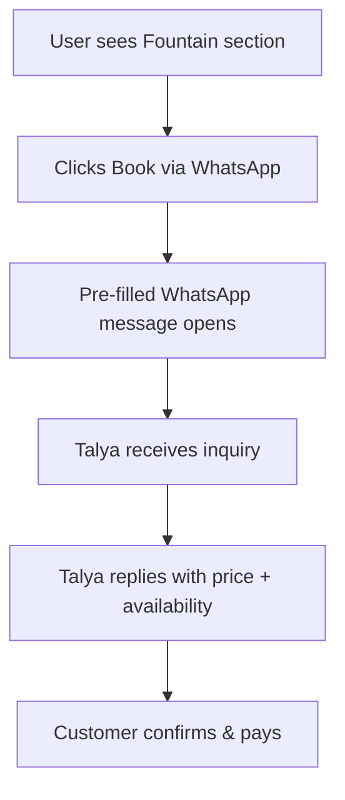
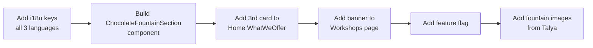

# Chocolate Fountain Hospitality — Design Document

> **Status:** Draft — Awaiting Price Confirmation & Approval
> **Feature:** Event Hospitality with Chocolate Fountain (מזרקת שוקולד)
> **Owner:** Talya
> **Tech Lead:** Senior Software Engineer

---

## 1. Overview

Sweets by Talya is adding a **third service pillar** alongside pralines and workshops:

> **Chocolate Fountain Hospitality** — Talya arrives at your event with a full chocolate fountain setup, a beautifully styled sweet table, and all the dipping treats. Guests enjoy a premium, hands-on dessert experience while Talya handles everything.

This is inspired by the promotional flyer (מזרקת שוקולד) which highlights:
- Full-service hospitality for events
- A styled sweet table (designed & decorated by Talya)
- Dipping items: fruits, marshmallows, brownies, churros
- Suitable for: birthdays, gatherings, meetings, any event
- Talya manages the entire experience so hosts can enjoy with their guests

---

## 2. What the Service Includes

| Item | Details |
|---|---|
| 🍫 Chocolate Fountain | White or dark chocolate waterfall machine, operated by Talya |
| 🍓 Fruits | Seasonal fresh fruits (strawberries, banana, pineapple, etc.) |
| 🍡 Marshmallows | Soft marshmallows on skewers |
| 🍫 Brownies | Talya's homemade bite-sized brownies |
| 🥐 Churros | Mini churros for dipping |
| 🎨 Styled Table | Decorated sweet table — designed and styled by Talya |
| 👩‍🍳 Full Service | Talya is present for the full event duration |
| 📍 Location | Talya comes to your venue (Even Yehuda area and surroundings) |

---

## 3. Pricing

> **⚠️ Price TBD — Talya will provide pricing before implementation.**

Pricing model options to discuss with Talya:

| Option | Description |
|---|---|
| **Flat rate per event** | Single price for up to N guests, e.g. ₪XXX for up to 30 guests |
| **Per-guest pricing** | Base price + per-person fee above a minimum |
| **Price on request** | No price shown — CTA goes directly to WhatsApp inquiry |

**Recommendation:** Start with "Price on request" (contact via WhatsApp) since pricing likely depends on guest count, duration, and location. This is the same pattern used for workshops.

---

## 4. Pages Affected

The new section must appear on **every page that showcases what Sweets by Talya offers**:

| Page | Where to Add |
|---|---|
| [`/` Home](src/pages/Home.jsx) | New card in the `WhatWeOffer` section (alongside pralines & workshops cards) |
| [`/workshops` Workshops](src/pages/Workshops.jsx) | Banner/teaser section at the bottom of the page |
| [`/about` About](src/pages/About.jsx) | Mention in services section |
| [`/contact` Contact](src/pages/Contact.jsx) | Add "Chocolate Fountain" as an inquiry type option |
| [`/gallery` Gallery](src/pages/Gallery.jsx) | New filter category for fountain photos (future-ready) |

---

## 5. New Components to Build

### 5.1 `ChocolateFountainSection` — Shared Reusable Section

A standalone, reusable React component that can be dropped into any page.

**File:** `src/components/fountain/ChocolateFountainSection.jsx`
**CSS:** `src/components/fountain/ChocolateFountainSection.css`

**Visual layout:**

```
┌─────────────────────────────────────────────────────────┐
│  [Photo of fountain setup]   │  🍫 Chocolate Fountain   │
│                              │  Hospitality             │
│                              │                          │
│                              │  Bring the magic of a    │
│                              │  chocolate fountain to   │
│                              │  your event.             │
│                              │                          │
│                              │  ✅ Fruits               │
│                              │  ✅ Marshmallows          │
│                              │  ✅ Brownies              │
│                              │  ✅ Churros               │
│                              │                          │
│                              │  🎂 Birthdays            │
│                              │  🎉 Gatherings           │
│                              │  💼 Corporate events     │
│                              │                          │
│                              │  [Book via WhatsApp]     │
└─────────────────────────────────────────────────────────┘
```

**Props:**
- `variant` — `"card"` (for Home offer-cards grid) | `"banner"` (full-width for other pages)
- `showPrice` — `boolean` (false until price is confirmed)

---

### 5.2 Home Page — Third Offer Card

Add a third card to the existing `WhatWeOffer` grid in [`src/pages/Home.jsx`](src/pages/Home.jsx).

The grid currently has 2 cards (pralines, workshops). The fountain becomes the **third card**, using the same `offer-card` CSS class pattern.

```
┌──────────────┐  ┌──────────────┐  ┌──────────────┐
│  🍫 Pralines │  │  🎨 Workshop │  │  🍫 Fountain │
│  for Events  │  │  Experience  │  │  Hospitality │
└──────────────┘  └──────────────┘  └──────────────┘
```

---

### 5.3 Dedicated Page `/fountain` (Optional — Phase 2)

A full dedicated page similar to [`/workshops`](src/pages/Workshops.jsx) with:
- Hero section with fountain photo
- Full service description
- What's included list
- Occasions it's perfect for
- Inquiry / booking CTA

**Route:** `/fountain`
**File:** `src/pages/ChocolateFountain.jsx`
**CSS:** `src/pages/ChocolateFountain.css`

---

## 6. i18n — Translation Keys

All three language files must be updated:
- [`public/locales/en/translation.json`](public/locales/en/translation.json)
- [`public/locales/he/translation.json`](public/locales/he/translation.json)
- [`public/locales/pt/translation.json`](public/locales/pt/translation.json)

### New keys (namespace: `fountain`):

```json
{
  "fountain": {
    "nav_label": "Chocolate Fountain",
    "offer_title": "Chocolate Fountain Hospitality",
    "offer_desc": "Bring the magic of a flowing chocolate fountain to your event. Talya arrives with everything — a styled sweet table, fresh dipping treats, and full service so you can enjoy every moment with your guests.",
    "item_fruits": "Fresh seasonal fruits",
    "item_marshmallows": "Soft marshmallows",
    "item_brownies": "Homemade brownies",
    "item_churros": "Mini churros",
    "occasion_1": "Birthday parties & celebrations",
    "occasion_2": "Gatherings & meetings",
    "occasion_3": "Corporate events",
    "occasion_4": "Any special occasion",
    "cta": "Book via WhatsApp",
    "price_label": "Price on request",
    "full_service_note": "Talya handles everything — you just enjoy with your guests",
    "page_title": "Chocolate Fountain Hospitality",
    "page_subtitle": "A sweet experience that flows",
    "includes_title": "What's Included",
    "occasions_title": "Perfect For"
  }
}
```

Hebrew equivalents (מזרקת שוקולד):
```json
{
  "fountain": {
    "nav_label": "מזרקת שוקולד",
    "offer_title": "הכנסת אורחים עם מזרקת שוקולד",
    "offer_desc": "הביאו את הקסם של מזרקת שוקולד זורמת לאירוע שלכם. טליה מגיעה עם הכל — שולחן ממתקים מעוצב, פינוקים לטבילה, ושירות מלא כדי שתוכלו ליהנות עם האורחים.",
    "item_fruits": "פירות טריים עונתיים",
    "item_marshmallows": "מרשמלו רך",
    "item_brownies": "בראוניז תוצרת בית",
    "item_churros": "צ'ורוס מיני",
    "occasion_1": "ימי הולדת וחגיגות",
    "occasion_2": "מפגשים ואירועים",
    "occasion_3": "אירועים עסקיים",
    "occasion_4": "כל אירוע מיוחד",
    "cta": "הזמינו בוואטסאפ",
    "price_label": "מחיר לפי פנייה",
    "full_service_note": "טליה דואגת לכל השאר — אתם רק נהנים עם האורחים",
    "page_title": "הכנסת אורחים עם מזרקת שוקולד",
    "page_subtitle": "חוויה מתוקה שזורמת",
    "includes_title": "מה כלול",
    "occasions_title": "מתאים ל"
  }
}
```

---

## 7. Ordering / Booking Flow

Since pricing is TBD, the booking flow will use **WhatsApp inquiry** (same as workshops):



**Pre-filled WhatsApp message template:**
```
היי טליה! אני מעוניין/ת בהכנסת אורחים עם מזרקת שוקולד לאירוע שלי.

📅 תאריך האירוע: 
👥 מספר אורחים משוער: 
📍 מיקום: 
📝 פרטים נוספים: 
```

This message is generated via the existing [`getWhatsAppOrderLink()`](src/config/social.js) utility.

---

## 8. Feature Flag

Add a feature flag to [`src/config/featureFlags.js`](src/config/featureFlags.js) so the feature can be toggled:

```js
/** Chocolate Fountain hospitality service */
chocolateFountain: import.meta.env.VITE_CHOCOLATE_FOUNTAIN_ENABLED !== 'false',
```

Default: **enabled** (opt-out pattern, same as other features).

---

## 9. Navbar Update

Add "Chocolate Fountain" (מזרקת שוקולד) as a nav link pointing to `/fountain` once the dedicated page exists.

For Phase 1 (section-only, no dedicated page), no navbar change is needed — the section is discoverable via the Home page offer cards.

---

## 10. Images Required

| Asset | Description | Where to place |
|---|---|---|
| Fountain hero photo | The white chocolate fountain from the flyer | `public/images/fountain/fountain-hero.jpg` |
| Table setup photo | Full sweet table setup (like the second reference photo) | `public/images/fountain/fountain-table.jpg` |
| Additional photos | Any other fountain/event photos Talya has | `public/images/fountain/` |

> **Action needed from Talya:** Provide high-quality photos of the fountain setup for the website.

---

## 11. Implementation Phases

### Phase 1 — Section on Home + Key Pages (implement now, price TBD)



**Files to create:**
- `src/components/fountain/ChocolateFountainSection.jsx`
- `src/components/fountain/ChocolateFountainSection.css`

**Files to modify:**
- `src/pages/Home.jsx` — add third offer card
- `src/pages/Workshops.jsx` — add fountain teaser at bottom
- `src/pages/Home.css` — adjust 3-column grid
- `src/config/featureFlags.js` — add flag
- `public/locales/en/translation.json`
- `public/locales/he/translation.json`
- `public/locales/pt/translation.json`

### Phase 2 — Dedicated Page `/fountain` (after price confirmed)

**Files to create:**
- `src/pages/ChocolateFountain.jsx`
- `src/pages/ChocolateFountain.css`

**Files to modify:**
- `src/App.jsx` — add route
- `src/components/layout/Navbar.jsx` — add nav link
- `src/pages/Home.jsx` — update CTA link to `/fountain`

---

## 12. Open Questions for Talya

| # | Question | Status |
|---|---|---|
| 1 | What is the price? (flat rate, per-guest, or price-on-request?) | ⏳ Pending |
| 2 | What is the service area / travel radius? | ⏳ Pending |
| 3 | What is the minimum/maximum guest count? | ⏳ Pending |
| 4 | How far in advance must events be booked? | ⏳ Pending |
| 5 | Can you provide high-quality photos of the fountain setup? | ⏳ Pending |
| 6 | Should the fountain page be in the navbar immediately, or only after Phase 2? | ⏳ Pending |
| 7 | Is white chocolate only, or also dark/milk chocolate options? | ⏳ Pending |

---

## 13. Summary

| Aspect | Decision |
|---|---|
| **Service name** | Chocolate Fountain Hospitality / מזרקת שוקולד |
| **Booking method** | WhatsApp inquiry (pre-filled message) |
| **Pricing display** | "Price on request" until Talya confirms |
| **Phase 1 scope** | Shared section component on Home + Workshops pages |
| **Phase 2 scope** | Dedicated `/fountain` page + navbar link |
| **Feature flag** | `VITE_CHOCOLATE_FOUNTAIN_ENABLED` (default: on) |
| **i18n** | EN + HE + PT |
| **Images needed** | Talya to provide fountain photos |
