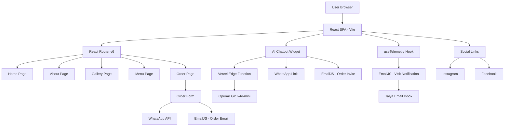
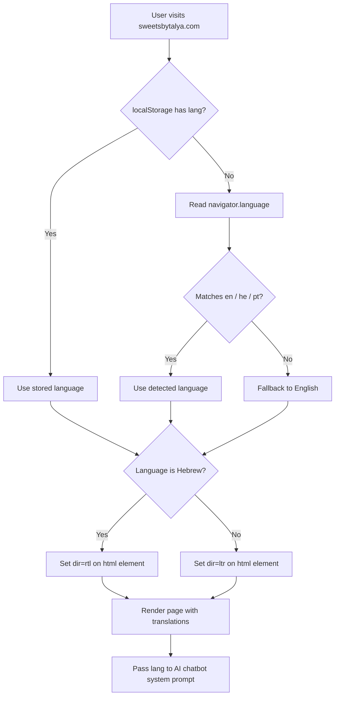
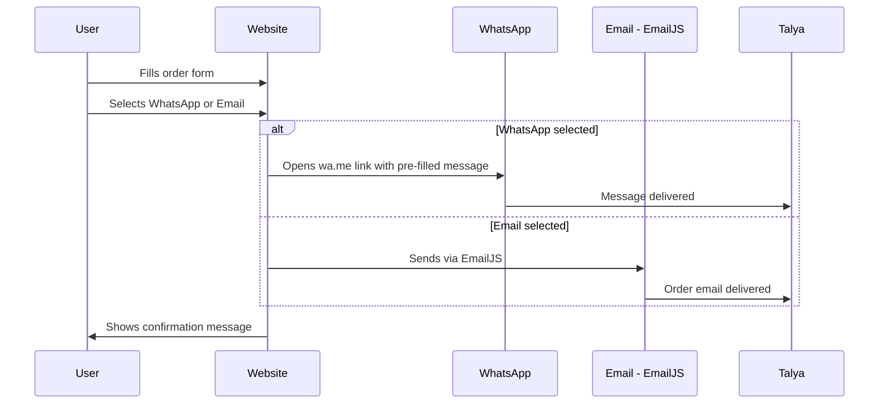
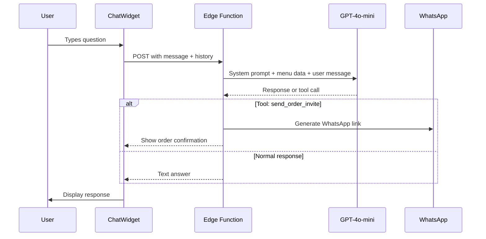

# Sweets by Talya — Website Design Document

> **Status:** Draft — Awaiting Approval
> **Owner:** Talya
> **Tech Lead:** Senior Software Engineer
> **Target Domain:** [sweetsbytalya.com](http://sweetsbytalya.com)
> **Languages:** English 🇬🇧 | Hebrew 🇮🇱 | Portuguese 🇧🇷

---

## 1. Project Overview

**Sweets by Talya** is a boutique chocolate business run by Talya. She specializes in:
- **Pralines** (perlins) in various flavors
- **Chocolate products**
- **Brownies**

The website must be:
- Visually warm, inviting, and on-brand (chocolate/pastel tones)
- Easy to navigate for all ages
- AI-powered to reduce manual effort
- Ready to scale toward e-commerce (credit card payments in the future)

---

## 2. Tech Stack

| Layer | Technology | Reason |
|---|---|---|
| Frontend Framework | **React 18** (Vite) | Fast, component-based, great ecosystem |
| Styling | **CSS Modules + custom CSS** | Scoped styles, no heavy framework needed |
| Routing | **React Router v6** | SPA multi-page navigation |
| Internationalisation | **i18next + react-i18next** | Auto language detection, RTL support, JSON translation files |
| AI Chatbot | **OpenAI GPT-4o-mini** | Cost-effective, fast, smart enough for product Q&A |
| Order Flow | **WhatsApp API link + EmailJS** | No backend needed for MVP |
| Telemetry | **EmailJS** (server-side-free email) | Notify owner on each visit |
| Media Gallery | **React Photo Album + lightbox** | Beautiful image/video grid |
| Env Secrets | **Vite `.env` files** | `VITE_` prefix, never committed |
| CI/CD | **GitHub Actions** | Build + deploy pipeline on every push to `main` |
| Hosting | **Vercel** (deployed via GitHub Actions) | Free tier, Edge Functions for AI proxy, custom domain |
| Future Payments | **Stripe** (placeholder/ready) | Industry standard, easy to add later |

---

## 3. Pages & Routing

```
/               → Home (Hero + highlights)
/about          → About Talya & the business
/gallery        → Photos & Videos
/order          → Order Form (WhatsApp / Email)
/menu           → Product Menu with prices & ingredients
```

---

## 4. Page-by-Page Design

### 4.1 Home Page (`/`)

**Purpose:** First impression — warm, delicious, inviting.

**Sections:**
1. **Hero Banner** — Full-width image of chocolates/pralines with tagline:  
   *"Handcrafted with love. Chocolate that tells a story."*  
   CTA buttons: `Order Now` → `/order` | `See Our Creations` → `/gallery`
2. **Featured Products Strip** — 3–4 product cards (pralines, brownies, chocolate boxes) with short descriptions
3. **Why Sweets by Talya** — 3 icon+text blocks: Handmade | Premium Ingredients | Custom Orders
4. **Instagram Feed Preview** — Latest 3–6 posts pulled via Instagram embed or static images
5. **Call to Action Banner** — "Ready to order? Let's talk!" with WhatsApp button
6. **Footer** — Social links, contact info, copyright

---

### 4.2 About Page (`/about`)

**Purpose:** Build trust and personal connection.

**Sections:**
1. **Hero image** of Talya (or her workspace)
2. **Story section** — Who is Talya, how she started, her passion for chocolate
3. **Values** — Handmade, quality ingredients, custom orders, love in every piece
4. **Process** — Short visual steps: "We source → We craft → We deliver"
5. **Social proof** — Customer quotes / testimonials (static for now)

---

### 4.3 Gallery Page (`/gallery`)

**Purpose:** Show off the beautiful products.

**Sections:**
1. **Filter tabs** — All | Pralines | Brownies | Chocolate | Custom Orders
2. **Masonry/grid photo gallery** — Lightbox on click for full-size view
3. **Video section** — Embedded videos (Instagram Reels or uploaded MP4s)
4. **"Want something like this?" CTA** → `/order`

---

### 4.4 Menu Page (`/menu`)

**Purpose:** Let customers browse products, prices, and ingredients.

**Sections:**
1. **Category tabs** — Pralines | Brownies | Chocolate Boxes | Seasonal
2. **Product cards** — Each card shows:
   - Product name
   - Photo
   - Short description
   - Price (or "Price on request")
   - Ingredients list (expandable)
   - "Order This" button → pre-fills order form
3. **Allergen notice** — e.g., "Contains nuts, dairy, gluten"

> **Note:** Menu data will be stored in a simple `src/data/menu.js` file — easy to update without touching code.

---

### 4.5 Order Page (`/order`)

**Purpose:** Let customers place an order without payment (MVP).

**Form Fields:**
- Full Name (required)
- Phone Number (required — at least one of phone/email)
- Email Address (required — at least one of phone/email)
- Product(s) interested in (multi-select or free text)
- Quantity / Notes
- Preferred contact method: WhatsApp | Email

**On Submit:**
- If WhatsApp selected → opens `https://wa.me/{PHONE}?text=...` with pre-filled message
- If Email selected → sends via **EmailJS** to owner's email
- Confirmation message shown to user

**Future-ready:** Form structure is designed to plug into Stripe Checkout later (add payment step after form).

---

## 5. AI Chatbot

### 5.1 Overview

A floating chat bubble (bottom-right corner) that appears on all pages. Users can:
- Ask what products are available
- Ask about prices and ingredients
- Ask about allergens
- Ask how to order
- Request a custom order (bot sends an invite/summary)

### 5.2 Architecture

```
User types message
      ↓
React ChatWidget component
      ↓
POST /api/chat  (or direct OpenAI call from frontend with key)
      ↓
OpenAI GPT-4o-mini
  - System prompt: injected with full menu, prices, ingredients, ordering instructions
  - Tool: send_order_invite (structured output → triggers WhatsApp/email)
      ↓
Response rendered in chat bubble
```

> **Security note:** The OpenAI API key will be in `VITE_OPENAI_API_KEY`. For production, we strongly recommend proxying through a lightweight serverless function (Vercel Edge Function) so the key is never exposed in the browser bundle. This will be built in from day one.

### 5.3 System Prompt Design

The system prompt will include:
- Business name, owner name, tone (warm, friendly, helpful)
- Full product list with prices and ingredients (injected from `menu.js`)
- Ordering instructions (WhatsApp number, email)
- What the bot can and cannot do
- **Language awareness:** The bot detects the user's language from the browser and responds in the same language (English, Hebrew, or Portuguese). The system prompt instructs GPT to always reply in the language the user writes in.

### 5.4 AI Tool: `send_order_invite`

When a user expresses intent to order, the bot can call a tool that:
1. Collects: name, product, quantity, contact info
2. Generates a WhatsApp link or triggers an EmailJS send
3. Confirms to the user: "I've sent your order request to Talya!"

### 5.5 Chatbot UI

- Floating bubble: chocolate-brown circle with a chat icon
- Opens as a slide-up panel (mobile-friendly)
- Shows typing indicator while waiting for GPT response
- "Powered by AI" badge at bottom
- Feature flag: `VITE_CHATBOT_ENABLED=true`

---

## 6. Telemetry / Visit Notifications

### 6.1 Goal

Every time a user visits the website, Talya receives an email notification so she can track traffic without needing Google Analytics dashboards.

### 6.2 Implementation

- On app load, a `useEffect` fires once per session (using `sessionStorage` to avoid duplicate sends on re-renders)
- Sends an email via **EmailJS** with:
  - Timestamp
  - Page visited
  - Referrer (where they came from)
  - User agent (device type)
  - Approximate location (via `navigator.language` / timezone)
- Feature flag: `VITE_TELEMETRY_ENABLED=true` (on by default)

### 6.3 Email Template

```
Subject: 🍫 New visitor on SweetsByTalya.com!

Time: {timestamp}
Page: {page}
Referrer: {referrer}
Device: {device}
Language: {language}
```

> **Future upgrade:** Can swap EmailJS for a proper analytics service (PostHog, Plausible) with zero code changes — just swap the telemetry hook.

---

## 7. Social Media Integration

- **Instagram** link in header nav + footer
- **Facebook** link in footer
- **WhatsApp** floating button (separate from chatbot) — always visible
- Instagram feed preview on Home page (static images or oEmbed)

All social links stored in `src/config/social.js` — easy to update.

---

## 8. Environment Variables

All secrets stored in `.env.local` (never committed — `.gitignore` enforced):

```env
# Contact
VITE_WHATSAPP_PHONE=972XXXXXXXXX
VITE_CONTACT_EMAIL=talya@sweetsbytalya.com

# EmailJS (for order form + telemetry)
VITE_EMAILJS_SERVICE_ID=...
VITE_EMAILJS_ORDER_TEMPLATE_ID=...
VITE_EMAILJS_TELEMETRY_TEMPLATE_ID=...
VITE_EMAILJS_PUBLIC_KEY=...

# OpenAI
VITE_OPENAI_API_KEY=sk-...

# Feature Flags
VITE_TELEMETRY_ENABLED=true
VITE_CHATBOT_ENABLED=true
VITE_PAYMENTS_ENABLED=false
```

---

## 9. Project File Structure

```
SweetsByTalya/
├── .gitignore
├── .env.example              ← committed (no real values)
├── .env.local                ← NOT committed
├── index.html
├── vite.config.js
├── vercel.json               ← Vercel routing config (rewrites for /api/*)
├── package.json
├── plans/
│   └── design.md
├── .github/
│   └── workflows/
│       └── deploy.yml        ← GitHub Actions CI/CD pipeline
├── public/
│   ├── favicon.ico
│   ├── og-image.jpg          ← social share preview image
│   └── locales/              ← i18n translation JSON files (served statically)
│       ├── en/
│       │   └── translation.json
│       ├── he/
│       │   └── translation.json
│       └── pt/
│           └── translation.json
├── src/
│   ├── main.jsx
│   ├── App.jsx
│   ├── i18n.js               ← i18next config + language detector
│   ├── index.css             ← global styles, CSS variables
│   ├── config/
│   │   ├── social.js         ← Instagram, Facebook, WhatsApp links
│   │   └── featureFlags.js
│   ├── data/
│   │   └── menu.js           ← products, prices, ingredients (easy to edit)
│   ├── pages/
│   │   ├── Home.jsx
│   │   ├── About.jsx
│   │   ├── Gallery.jsx
│   │   ├── Menu.jsx
│   │   └── Order.jsx
│   ├── components/
│   │   ├── layout/
│   │   │   ├── Navbar.jsx    ← includes language switcher (EN | HE | PT)
│   │   │   └── Footer.jsx
│   │   ├── home/
│   │   │   ├── Hero.jsx
│   │   │   ├── FeaturedProducts.jsx
│   │   │   ├── WhyUs.jsx
│   │   │   └── InstagramPreview.jsx
│   │   ├── gallery/
│   │   │   ├── PhotoGrid.jsx
│   │   │   └── VideoSection.jsx
│   │   ├── menu/
│   │   │   ├── ProductCard.jsx
│   │   │   └── CategoryTabs.jsx
│   │   ├── order/
│   │   │   └── OrderForm.jsx
│   │   ├── chatbot/
│   │   │   ├── ChatWidget.jsx
│   │   │   ├── ChatBubble.jsx
│   │   │   └── useOpenAI.js
│   │   └── shared/
│   │       ├── WhatsAppButton.jsx
│   │       ├── LanguageSwitcher.jsx  ← EN | HE | PT toggle
│   │       └── SocialLinks.jsx
│   ├── hooks/
│   │   ├── useTelemetry.js
│   │   └── useEmailJS.js
│   └── api/
│       └── chatProxy.js      ← Vercel Edge Function (keeps API key server-side)
```

---

## 10. Design System

### Color Palette

| Name | Hex | Usage |
|---|---|---|
| Chocolate Dark | `#3B1F0E` | Primary text, navbar |
| Chocolate Mid | `#6B3A2A` | Buttons, accents |
| Caramel | `#C8813A` | Highlights, CTAs |
| Cream | `#FDF6EC` | Page background |
| Blush Pink | `#F2C4CE` | Soft accents, cards |
| White | `#FFFFFF` | Cards, panels |

### Typography

- **Headings:** `Playfair Display` (Google Fonts) — elegant, luxurious
- **Body:** `Lato` or `Inter` — clean, readable
- **Accent:** `Dancing Script` — for taglines and special text

### Design Principles

- Warm, feminine, artisanal aesthetic
- Lots of whitespace — let the product photos breathe
- Rounded corners on cards and buttons
- Subtle drop shadows
- Smooth hover transitions (0.2s ease)
- Mobile-first responsive design

---

## 11. Future Roadmap (Credit Card Payments)

The order form is designed to be payment-ready:

1. **Phase 1 (Now):** Order form → WhatsApp/Email, no payment
2. **Phase 2 (Future):** Add Stripe Checkout step after form submission
   - Product selection maps to Stripe Price IDs
   - Stripe handles PCI compliance
   - Webhook confirms payment → triggers order notification
3. **Phase 3 (Future):** Full cart + checkout flow

The `VITE_PAYMENTS_ENABLED=false` flag gates this feature until ready.

---

## 12. Internationalisation (i18n)

### 12.1 Supported Languages

| Language | Code | Direction | Auto-detected from |
|---|---|---|---|
| English | `en` | LTR | Browser `navigator.language` |
| Hebrew | `he` | **RTL** | Browser `navigator.language` |
| Portuguese | `pt` | LTR | Browser `navigator.language` |

### 12.2 Library: `i18next` + `react-i18next`

- **`i18next-browser-languagedetector`** — automatically reads `navigator.language` on first visit, falls back to `en`
- **`i18next-http-backend`** — loads translation JSON files lazily from `/public/locales/{lang}/translation.json`
- User can also manually switch language via the `LanguageSwitcher` component in the Navbar
- Selected language is persisted in `localStorage` so it survives page refreshes

### 12.3 RTL Support (Hebrew)

When `he` is active:
- `document.documentElement.dir` is set to `"rtl"`
- `document.documentElement.lang` is set to `"he"`
- CSS uses `[dir="rtl"]` selectors to flip layout (margins, paddings, text alignment, flex direction)
- No separate RTL stylesheet needed — handled via CSS logical properties where possible

### 12.4 Translation File Structure

Each `translation.json` contains keys for every UI string:

```json
{
  "nav": {
    "home": "Home",
    "about": "About",
    "gallery": "Gallery",
    "menu": "Menu",
    "order": "Order"
  },
  "hero": {
    "tagline": "Handcrafted with love. Chocolate that tells a story.",
    "cta_order": "Order Now",
    "cta_gallery": "See Our Creations"
  },
  "chatbot": {
    "greeting": "Hi! I'm Talya's chocolate assistant. How can I help you today?"
  }
}
```

Hebrew (`he`) and Portuguese (`pt`) files mirror the same key structure.

### 12.5 AI Chatbot Language Awareness

The chatbot system prompt includes:

> "The user's browser language is `{detectedLang}`. Always respond in that language. If the user writes in Hebrew, respond in Hebrew. If in Portuguese, respond in Portuguese. If in English, respond in English. You may switch language mid-conversation if the user switches."

The detected language is passed as part of every API request to the Edge Function.

### 12.6 Language Switcher UI

- Located in the Navbar (top-right)
- Three flag/text buttons: `🇬🇧 EN` | `🇮🇱 HE` | `🇧🇷 PT`
- Active language is highlighted
- On switch: page re-renders with new translations instantly (no reload)

---

## 13. Additional Suggested Features

| Feature | Description | Priority |
|---|---|---|
| **Menu page** | Browse products with prices + ingredients | High |
| **WhatsApp floating button** | Always-visible quick contact | High |
| **Trilingual support** | EN / HE / PT with auto-detection and RTL for Hebrew | High |
| **Seasonal banner** | Announce holiday specials (Passover, Purim, etc.) | Medium |
| **Testimonials section** | Customer reviews on Home/About | Medium |
| **Custom order request** | Special form for custom chocolate boxes | Medium |
| **SEO optimization** | Meta tags, OG image, sitemap, hreflang tags per language | High |
| **Cookie consent banner** | GDPR-lite compliance | Low |
| **Admin-friendly content** | All text/prices in data files, no code needed to update | High |

---

## 14. Deployment — GitHub Actions + Vercel

### 14.1 Pipeline Overview

```
Developer pushes to main branch on GitHub
        ↓
GitHub Actions workflow triggers
        ↓
1. npm ci
2. npm run build  (Vite produces /dist)
3. npx vercel --prod --token=$VERCEL_TOKEN
        ↓
Vercel serves static /dist + Edge Function /api/chat
        ↓
sweetsbytalya.com (custom domain → Vercel DNS)
```

### 14.2 GitHub Actions Workflow (`.github/workflows/deploy.yml`)

```yaml
name: Deploy to Vercel
on:
  push:
    branches: [main]
  pull_request:
    branches: [main]

jobs:
  deploy:
    runs-on: ubuntu-latest
    steps:
      - uses: actions/checkout@v4
      - uses: actions/setup-node@v4
        with:
          node-version: 20
          cache: npm
      - run: npm ci
      - run: npm run build
      - name: Deploy to Vercel
        run: npx vercel --prod --token=${{ secrets.VERCEL_TOKEN }}
        env:
          VERCEL_ORG_ID: ${{ secrets.VERCEL_ORG_ID }}
          VERCEL_PROJECT_ID: ${{ secrets.VERCEL_PROJECT_ID }}
```

Pull Requests get a **preview deployment URL** automatically from Vercel.

### 14.3 GitHub Actions Secrets Required

| Secret | Description |
|---|---|
| `VERCEL_TOKEN` | Vercel personal access token |
| `VERCEL_ORG_ID` | Vercel org/team ID |
| `VERCEL_PROJECT_ID` | Vercel project ID |
| `VITE_WHATSAPP_PHONE` | WhatsApp number (injected at build time) |
| `VITE_CONTACT_EMAIL` | Contact email (injected at build time) |
| `VITE_EMAILJS_SERVICE_ID` | EmailJS service ID |
| `VITE_EMAILJS_ORDER_TEMPLATE_ID` | EmailJS order template |
| `VITE_EMAILJS_TELEMETRY_TEMPLATE_ID` | EmailJS telemetry template |
| `VITE_EMAILJS_PUBLIC_KEY` | EmailJS public key |
| `OPENAI_API_KEY` | OpenAI key — stored in Vercel env vars only, never in GitHub |

### 14.4 Custom Domain Setup

1. Buy domain (e.g., via Namecheap, GoDaddy, or Google Domains)
2. In Vercel dashboard → Project Settings → Domains → Add `sweetsbytalya.com`
3. Update DNS at registrar: point `A` record to Vercel's IP, `CNAME www` to `cname.vercel-dns.com`
4. Vercel auto-provisions SSL certificate (Let's Encrypt)

---

## 15. Mermaid — System Architecture



---

## 16. Mermaid — i18n Language Detection Flow



---

## 17. Mermaid — Order Flow



---

## 18. Mermaid — AI Chatbot Flow



---

---

## 19. Environment Variables (Updated)

All secrets stored in `.env.local` locally and in **GitHub Actions Secrets** + **Vercel Environment Variables** for production:

```env
# Contact
VITE_WHATSAPP_PHONE=972XXXXXXXXX
VITE_CONTACT_EMAIL=talya@sweetsbytalya.com

# EmailJS (for order form + telemetry)
VITE_EMAILJS_SERVICE_ID=...
VITE_EMAILJS_ORDER_TEMPLATE_ID=...
VITE_EMAILJS_TELEMETRY_TEMPLATE_ID=...
VITE_EMAILJS_PUBLIC_KEY=...

# OpenAI — server-side only (Vercel env var, NOT prefixed with VITE_)
OPENAI_API_KEY=sk-...

# Feature Flags
VITE_TELEMETRY_ENABLED=true
VITE_CHATBOT_ENABLED=true
VITE_PAYMENTS_ENABLED=false

# i18n default (optional override)
VITE_DEFAULT_LANGUAGE=en
```

---

*Document version: 2.0 | Created: 2026-03-31 | Updated: trilingual support + GitHub Actions deployment*
