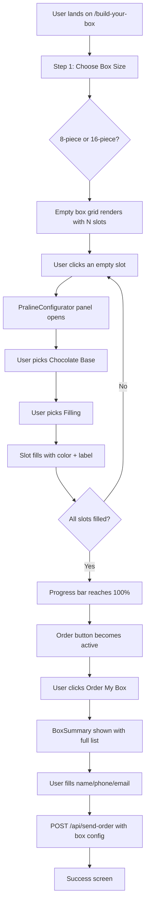

# 🍫 Build Your Own Box — Praline Builder Feature Design

## 1. Overview

The **Build Your Own Box** feature lets customers interactively compose a custom praline box by selecting a chocolate base and filling for each individual praline slot. The experience is visual, tactile, and fun — like placing chocolates into a real box.

**Entry point:** `/build-your-box` (new route, linked from Navbar and Menu page)

**Box sizes:** 8-piece or 16-piece

**Pricing model:** `base.price + filling.price = praline price`. The running total is shown live as the user fills each slot. Prices are defined in [`src/data/pralines.js`](src/data/pralines.js) and can be updated without touching any component code.

---

## 2. User Flow



---

## 3. Data Model

### 3.1 Chocolate Bases (`src/data/pralines.js`)

Each base has a fixed `price` in ₪. Prices below are **placeholders** — update them in [`src/data/pralines.js`](src/data/pralines.js) when Talya provides the real values.

```js
export const chocolateBases = [
  { id: 'dark_70', labelKey: 'praline.bases.dark_70', color: '#3B1F0E', emoji: '🍫', price: 5 },
  { id: 'dark_50', labelKey: 'praline.bases.dark_50', color: '#5C3317', emoji: '🍫', price: 5 },
  { id: 'milk',    labelKey: 'praline.bases.milk',    color: '#C68642', emoji: '🍫', price: 5 },
  { id: 'white',   labelKey: 'praline.bases.white',   color: '#FFF5DC', emoji: '🤍', price: 5 },
]
```

### 3.2 Fillings (`src/data/pralines.js`)

Each filling has its own `price` in ₪. Prices below are **placeholders** — update when Talya provides real values.

```js
export const fillings = [
  { id: 'pistachio', labelKey: 'praline.fillings.pistachio', color: '#93C572', emoji: '🌿', price: 5 },
  { id: 'vanilla',   labelKey: 'praline.fillings.vanilla',   color: '#F3E5AB', emoji: '🌼', price: 4 },
  { id: 'caramel',   labelKey: 'praline.fillings.caramel',   color: '#C19A6B', emoji: '🍯', price: 4 },
  { id: 'mango',     labelKey: 'praline.fillings.mango',     color: '#FFB347', emoji: '🥭', price: 5 },
  { id: 'cherry',    labelKey: 'praline.fillings.cherry',    color: '#C0392B', emoji: '🍒', price: 6 },
  { id: 'dubai',     labelKey: 'praline.fillings.dubai',     color: '#D4A017', emoji: '✨', price: 7 },
  { id: 'halva',     labelKey: 'praline.fillings.halva',     color: '#E8D5B7', emoji: '🌾', price: 4 },
  { id: 'pecan',     labelKey: 'praline.fillings.pecan',     color: '#8B6914', emoji: '🥜', price: 5 },
  { id: 'coconut',   labelKey: 'praline.fillings.coconut',   color: '#FAFAFA', emoji: '🥥', price: 4 },
]
```

### 3.3 Pricing Calculation

```js
// Price of a single configured praline:
const pralinePrice = (slot) => {
  const base    = chocolateBases.find(b => b.id === slot.base)
  const filling = fillings.find(f => f.id === slot.filling)
  return base.price + filling.price
}

// Total box price (only filled slots count):
const boxTotal = slots
  .filter(Boolean)
  .reduce((sum, slot) => sum + pralinePrice(slot), 0)
```

The running total is displayed live in the `BuilderProgressBar` and in the `BoxSummary`.

### 3.4 Slot State Shape

Each slot in the box is represented as:

```js
// null = empty slot (not yet configured)
// or:
{
  slotIndex: 0,          // 0-based position in the box
  base: 'dark_70',       // chocolateBases[].id
  filling: 'pistachio',  // fillings[].id
}
```

### 3.5 Box State (held in `PralineBuilder` page)

```js
const [boxSize, setBoxSize] = useState(null)       // 8 | 16
const [slots, setSlots] = useState([])             // Array of null | { base, filling }
const [activeSlot, setActiveSlot] = useState(null) // index of slot being configured
```

---

## 4. Component Architecture

```
src/
├── data/
│   └── pralines.js                    ← chocolate bases + fillings data
├── pages/
│   ├── PralineBuilder.jsx             ← page container, holds all state
│   └── PralineBuilder.css
└── components/
    └── praline/
        ├── BoxSizeSelector.jsx        ← Step 1: 8 or 16 card picker
        ├── PralineSlotGrid.jsx        ← renders the N×M grid of slots
        ├── PralineSlot.jsx            ← single slot: empty or filled with color
        ├── PralineConfigurator.jsx    ← slide-up panel: pick base + filling
        ├── BuilderProgressBar.jsx     ← "X of N pralines filled" progress bar
        └── BoxSummary.jsx             ← final summary + order form
```

### 4.1 `PralineBuilder.jsx` (Page)

- Owns all state: `boxSize`, `slots[]`, `activeSlot`
- Renders in phases:
  1. `boxSize === null` → show `<BoxSizeSelector />`
  2. `boxSize` set → show `<BuilderProgressBar />` + `<PralineSlotGrid />` + `<PralineConfigurator />` (when `activeSlot !== null`)
  3. All slots filled → show `<BoxSummary />` with order form

### 4.2 `BoxSizeSelector.jsx`

- Two large clickable cards: **8-piece** and **16-piece**
- Each card shows a small visual preview of the grid layout (2×4 or 4×4)
- On click → sets `boxSize`, initializes `slots` array with `null` values

### 4.3 `PralineSlotGrid.jsx`

- Receives `slots[]`, `boxSize`, `onSlotClick(index)`
- Renders a CSS grid:
  - 8-piece → `grid-template-columns: repeat(4, 1fr)` (2 rows × 4 cols)
  - 16-piece → `grid-template-columns: repeat(4, 1fr)` (4 rows × 4 cols)
- Each cell renders a `<PralineSlot />`

### 4.4 `PralineSlot.jsx`

- Props: `slot` (null or `{base, filling}`), `index`, `isActive`, `onClick`
- **Empty state:** dashed border, `+` icon, "Click to fill" hint
- **Filled state:** solid background using `base.color`, small filling emoji + label badge
- **Active state:** glowing ring (CSS box-shadow) to indicate it's being configured

### 4.5 `PralineConfigurator.jsx`

- Slide-up panel (fixed bottom on mobile, side panel on desktop)
- Two-step internal state: `step: 'base' | 'filling'`
- **Step 1 — Base:** 4 cards (Dark 70%, Dark 50%, Milk, White) with color swatches
- **Step 2 — Filling:** 9 cards (Pistachio, Vanilla, Caramel, Mango, Cherry, Dubai, Halva, Pecan, Coconut) with emoji + color dot
- Back button to return to base selection
- Confirm button saves the slot and closes the panel
- Clicking outside / pressing Escape closes without saving

### 4.6 `BuilderProgressBar.jsx`

- Props: `filled` (count), `total` (boxSize), `runningTotal` (₪ sum so far)
- Visual: chocolate-brown filled bar, cream background
- Label: `"5 of 8 pralines filled · ₪45 so far"` (translated)
- When `filled === total`: bar turns gold/caramel, label changes to `"Box complete! 🎉 · Total: ₪88"`

### 4.7 `BoxSummary.jsx`

- Shows a read-only grid of all configured pralines (slot index, base name, filling name, per-piece price)
- Grouped summary: e.g. "3× Dark 70% / Pistachio — ₪24"
- **Total price line:** `"Box Total: ₪88"` prominently displayed
- Inline order form: Name, Phone, Email, Notes
- Submit button → serializes box config into a human-readable `product` string → POSTs to `/api/send-order`
- On success → shows the same success screen as the Order page

---

## 5. Order Serialization

When the user submits, the box config is serialized into a readable string for the email:

```
Custom Praline Box (8-piece) — Total: ₪88

  1. Dark 70% / Pistachio — ₪10
  2. Dark 70% / Caramel — ₪9
  3. Milk Chocolate / Vanilla — ₪9
  4. White Chocolate / Coconut — ₪9
  5. Dark 50% / Dubai (Kunafa & Pistachio) — ₪12
  6. Milk Chocolate / Cherry — ₪11
  7. Dark 70% / Halva — ₪9
  8. White Chocolate / Mango — ₪10
```

This string is passed as the `product` field to `/api/send-order` — **no API changes needed**.

---

## 6. Routing

Add to [`src/App.jsx`](src/App.jsx):

```jsx
const PralineBuilder = lazy(() => import('./pages/PralineBuilder'))
// ...
<Route path="/build-your-box" element={<PralineBuilder />} />
```

---

## 7. Navigation

Add to [`src/components/layout/Navbar.jsx`](src/components/layout/Navbar.jsx):

- New nav link: **"Build Your Box"** (between Menu and Order Now)
- Uses translation key `nav.build_box`
- On mobile: included in the hamburger menu

---

## 8. Translations

### 8.1 Keys to add to all 3 locale files

```json
{
  "nav": {
    "build_box": "Build Your Box"
  },
  "praline_builder": {
    "title": "Build Your Own Box",
    "subtitle": "Craft your perfect praline box, one chocolate at a time.",
    "choose_size": "Choose Your Box Size",
    "size_8": "8-Piece Box",
    "size_16": "16-Piece Box",
    "size_8_desc": "Perfect for a personal treat or small gift",
    "size_16_desc": "Ideal for sharing or a luxurious gift",
    "progress_label": "{{filled}} of {{total}} pralines filled",
    "progress_complete": "Box complete! 🎉",
    "slot_empty": "Click to fill",
    "slot_label": "Praline {{n}}",
    "configure_title": "Configure Praline {{n}}",
    "step_base": "Choose Chocolate Base",
    "step_filling": "Choose Filling",
    "back": "Back",
    "confirm_slot": "Confirm",
    "order_box": "Order My Box",
    "summary_title": "Your Box Summary",
    "summary_piece": "{{base}} / {{filling}}",
    "edit_box": "Edit Box",
    "your_details": "Your Details",
    "notes_placeholder": "Any allergies or special requests?",
    "submit": "Place My Order 🍫",
    "success_title": "Order sent! 🍫",
    "success_message": "Thank you! Talya will be in touch with you shortly."
  },
  "praline": {
    "bases": {
      "dark_70": "Dark 70%",
      "dark_50": "Dark 50%",
      "milk": "Milk Chocolate",
      "white": "White Chocolate"
    },
    "fillings": {
      "pistachio": "Pistachio",
      "vanilla": "Vanilla",
      "caramel": "Caramel",
      "mango": "Mango",
      "cherry": "Cherry",
      "dubai": "Dubai (Kunafa & Pistachio)",
      "halva": "Halva",
      "pecan": "Pecan",
      "coconut": "Coconut"
    }
  }
}
```

### 8.2 Hebrew (`he`) key names (same structure, translated values)

```json
{
  "nav": { "build_box": "בנה את הקופסה שלך" },
  "praline_builder": {
    "title": "בנה את הקופסה שלך",
    "subtitle": "הרכב את קופסת הפרלינים המושלמת שלך, שוקולד אחד בכל פעם.",
    "choose_size": "בחר את גודל הקופסה",
    "size_8": "קופסה של 8",
    "size_16": "קופסה של 16",
    "size_8_desc": "מושלם לפינוק אישי או מתנה קטנה",
    "size_16_desc": "אידיאלי לשיתוף או מתנה מפנקת",
    "progress_label": "{{filled}} מתוך {{total}} פרלינים מולאו",
    "progress_complete": "הקופסה מוכנה! 🎉",
    "slot_empty": "לחץ למילוי",
    "slot_label": "פרלין {{n}}",
    "configure_title": "הגדר פרלין {{n}}",
    "step_base": "בחר בסיס שוקולד",
    "step_filling": "בחר מילוי",
    "back": "חזרה",
    "confirm_slot": "אישור",
    "order_box": "הזמן את הקופסה שלי",
    "summary_title": "סיכום הקופסה שלך",
    "summary_piece": "{{base}} / {{filling}}",
    "edit_box": "ערוך קופסה",
    "your_details": "הפרטים שלך",
    "notes_placeholder": "אלרגיות או בקשות מיוחדות?",
    "submit": "שלח הזמנה 🍫",
    "success_title": "ההזמנה נשלחה! 🍫",
    "success_message": "תודה! טליה תיצור איתך קשר בקרוב."
  },
  "praline": {
    "bases": {
      "dark_70": "שוקולד מריר 70%",
      "dark_50": "שוקולד מריר 50%",
      "milk": "שוקולד חלב",
      "white": "שוקולד לבן"
    },
    "fillings": {
      "pistachio": "פיסטוק",
      "vanilla": "וניל",
      "caramel": "קרמל",
      "mango": "מנגו",
      "cherry": "דובדבן",
      "dubai": "דובאי (קנאפה ופיסטוק)",
      "halva": "חלווה",
      "pecan": "פקאן",
      "coconut": "קוקוס"
    }
  }
}
```

### 8.3 Portuguese (`pt`) — same structure, translated values

```json
{
  "nav": { "build_box": "Monte sua Caixa" },
  "praline_builder": {
    "title": "Monte sua Própria Caixa",
    "subtitle": "Crie sua caixa de pralinês perfeita, um chocolate de cada vez.",
    "choose_size": "Escolha o Tamanho da Caixa",
    "size_8": "Caixa de 8 Peças",
    "size_16": "Caixa de 16 Peças",
    "size_8_desc": "Perfeito para um mimo pessoal ou presente pequeno",
    "size_16_desc": "Ideal para compartilhar ou um presente luxuoso",
    "progress_label": "{{filled}} de {{total}} pralinês preenchidos",
    "progress_complete": "Caixa completa! 🎉",
    "slot_empty": "Clique para preencher",
    "slot_label": "Pralinê {{n}}",
    "configure_title": "Configurar Pralinê {{n}}",
    "step_base": "Escolha a Base de Chocolate",
    "step_filling": "Escolha o Recheio",
    "back": "Voltar",
    "confirm_slot": "Confirmar",
    "order_box": "Pedir Minha Caixa",
    "summary_title": "Resumo da Sua Caixa",
    "summary_piece": "{{base}} / {{filling}}",
    "edit_box": "Editar Caixa",
    "your_details": "Seus Dados",
    "notes_placeholder": "Alergias ou pedidos especiais?",
    "submit": "Fazer Meu Pedido 🍫",
    "success_title": "Pedido enviado! 🍫",
    "success_message": "Obrigado! Talya entrará em contato em breve."
  },
  "praline": {
    "bases": {
      "dark_70": "Chocolate Amargo 70%",
      "dark_50": "Chocolate Amargo 50%",
      "milk": "Chocolate ao Leite",
      "white": "Chocolate Branco"
    },
    "fillings": {
      "pistachio": "Pistache",
      "vanilla": "Baunilha",
      "caramel": "Caramelo",
      "mango": "Manga",
      "cherry": "Cereja",
      "dubai": "Dubai (Kunafa e Pistache)",
      "halva": "Halva",
      "pecan": "Noz-pecã",
      "coconut": "Coco"
    }
  }
}
```

---

## 9. Visual Design

### 9.1 Color Palette (extends existing design system)

| Token | Value | Usage |
|---|---|---|
| `--color-chocolate-dark` | `#3B1F0E` | Dark 70% base swatch |
| `--color-chocolate-mid` | `#5C3317` | Dark 50% base swatch |
| `--color-caramel` | `#C68642` | Milk chocolate swatch |
| `--color-cream` | `#FFF5DC` | White chocolate swatch |
| `--color-pistachio` | `#93C572` | Pistachio filling dot |
| `--color-gold` | `#D4A017` | Dubai filling + complete bar |

### 9.2 Layout Breakpoints

| Viewport | Grid | Configurator |
|---|---|---|
| Mobile (< 768px) | 4 columns, 2 or 4 rows | Slide-up bottom sheet |
| Tablet (768–1024px) | 4 columns | Side panel (right) |
| Desktop (> 1024px) | 4 columns | Side panel (right) |

### 9.3 Slot Visual States

```
┌─────────────────┐   ┌─────────────────┐   ┌─────────────────┐
│                 │   │  ████████████   │   │  ████████████   │
│       +         │   │  ██ 🌿 Pist. ██│   │  ████████████   │
│  Click to fill  │   │  ████████████   │   │  ████████████   │
│                 │   │                 │   │  [glowing ring] │
└─────────────────┘   └─────────────────┘   └─────────────────┘
     EMPTY                  FILLED                 ACTIVE
```

---

## 10. Configurator UX Detail

The `PralineConfigurator` is a two-step panel:

**Step 1 — Base Selection:**
```
┌──────────────────────────────────────────┐
│  Configure Praline 3                     │
│  ─────────────────────────────────────── │
│  Choose Chocolate Base                   │
│                                          │
│  ┌────────┐ ┌────────┐ ┌────────┐ ┌────┐│
│  │ ██████ │ │ ██████ │ │ ██████ │ │ ██ ││
│  │Dark 70%│ │Dark 50%│ │  Milk  │ │Wht ││
│  └────────┘ └────────┘ └────────┘ └────┘│
└──────────────────────────────────────────┘
```

**Step 2 — Filling Selection (after base chosen):**
```
┌──────────────────────────────────────────┐
│  ← Back    Configure Praline 3           │
│  ─────────────────────────────────────── │
│  Base: Dark 70%  ·  Choose Filling       │
│                                          │
│  ┌──────┐ ┌──────┐ ┌──────┐ ┌──────┐   │
│  │🌿    │ │🌼    │ │🍯    │ │🥭    │   │
│  │Pist. │ │Vanil.│ │Caram.│ │Mango │   │
│  └──────┘ └──────┘ └──────┘ └──────┘   │
│  ┌──────┐ ┌──────┐ ┌──────┐ ┌──────┐   │
│  │🍒    │ │✨    │ │🌾    │ │🥜    │   │
│  │Cherry│ │Dubai │ │Halva │ │Pecan │   │
│  └──────┘ └──────┘ └──────┘ └──────┘   │
│  ┌──────┐                               │
│  │🥥    │                               │
│  │Cocon.│                               │
│  └──────┘                               │
│                          [Confirm ✓]    │
└──────────────────────────────────────────┘
```

---

## 11. Progress Bar Detail

```
┌──────────────────────────────────────────────────────┐
│  5 of 8 pralines filled · ₪45 so far                │
│  ████████████████████████░░░░░░░░░░░░░░░░░░░░░░░░░░  │
└──────────────────────────────────────────────────────┘

When complete:
┌──────────────────────────────────────────────────────┐
│  Box complete! 🎉 · Total: ₪88                      │
│  ████████████████████████████████████████████████    │
│  (gold/caramel color)                                │
└──────────────────────────────────────────────────────┘
```

---

## 12. Email Format (sent to Talya)

The box config is serialized into the `product` field of the existing `/api/send-order` payload:

```
Custom Praline Box (8-piece) — Total: ₪88

  1. Dark 70% / Pistachio — ₪10
  2. Dark 70% / Caramel — ₪9
  3. Milk Chocolate / Vanilla — ₪9
  4. White Chocolate / Coconut — ₪9
  5. Dark 50% / Dubai (Kunafa & Pistachio) — ₪12
  6. Milk Chocolate / Cherry — ₪11
  7. Dark 70% / Halva — ₪9
  8. White Chocolate / Mango — ₪10
```

No changes to `api/send-order.js` are required — the serialized string is passed as `product`.

---

## 13. Pricing Update Workflow

When Talya provides the real prices, the implementer only needs to update **one file**:

**[`src/data/pralines.js`](src/data/pralines.js)** — change the `price` field on each base and filling object. All calculations, displays, and email serialization update automatically throughout the entire UI.

```js
// Before (placeholder):
{ id: 'dark_70', ..., price: 5 }

// After (real price from Talya):
{ id: 'dark_70', ..., price: 6 }
```

---

## 14. Feature Flag

Add to [`src/config/featureFlags.js`](src/config/featureFlags.js):

```js
pralineBuilder: import.meta.env.VITE_FEATURE_PRALINE_BUILDER !== 'false',
```

The nav link and route are only rendered when `flags.pralineBuilder` is `true`. Default is `true` (enabled).

---

## 15. File Checklist for Implementation

| File | Action |
|---|---|
| [`src/data/pralines.js`](src/data/pralines.js) | **Create** — bases + fillings arrays |
| [`src/pages/PralineBuilder.jsx`](src/pages/PralineBuilder.jsx) | **Create** — page with full state |
| [`src/pages/PralineBuilder.css`](src/pages/PralineBuilder.css) | **Create** — page layout styles |
| [`src/components/praline/BoxSizeSelector.jsx`](src/components/praline/BoxSizeSelector.jsx) | **Create** |
| [`src/components/praline/PralineSlotGrid.jsx`](src/components/praline/PralineSlotGrid.jsx) | **Create** |
| [`src/components/praline/PralineSlot.jsx`](src/components/praline/PralineSlot.jsx) | **Create** |
| [`src/components/praline/PralineConfigurator.jsx`](src/components/praline/PralineConfigurator.jsx) | **Create** |
| [`src/components/praline/BuilderProgressBar.jsx`](src/components/praline/BuilderProgressBar.jsx) | **Create** |
| [`src/components/praline/BoxSummary.jsx`](src/components/praline/BoxSummary.jsx) | **Create** |
| [`src/App.jsx`](src/App.jsx) | **Modify** — add `/build-your-box` route |
| [`src/components/layout/Navbar.jsx`](src/components/layout/Navbar.jsx) | **Modify** — add nav link |
| [`src/config/featureFlags.js`](src/config/featureFlags.js) | **Modify** — add `pralineBuilder` flag |
| [`public/locales/en/translation.json`](public/locales/en/translation.json) | **Modify** — add EN keys |
| [`public/locales/he/translation.json`](public/locales/he/translation.json) | **Modify** — add HE keys |
| [`public/locales/pt/translation.json`](public/locales/pt/translation.json) | **Modify** — add PT keys |

**No backend changes required.** The existing `/api/send-order` endpoint handles the order as-is.
